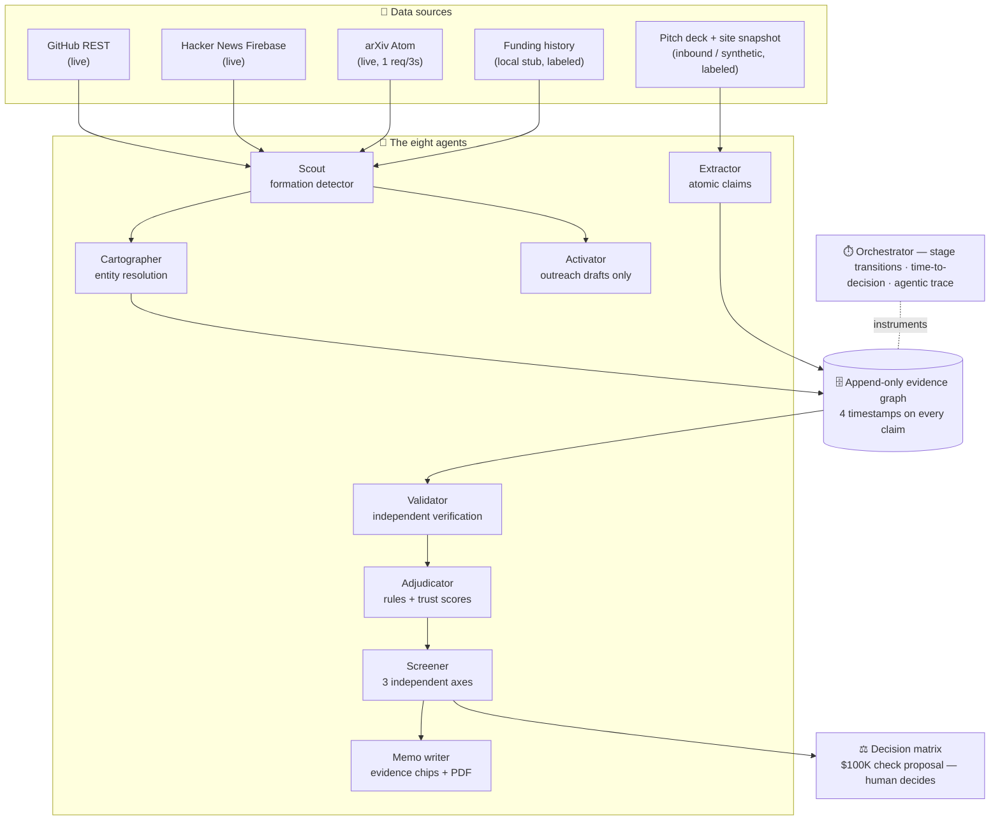
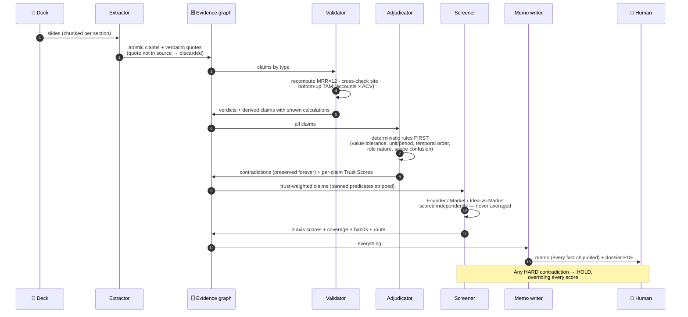
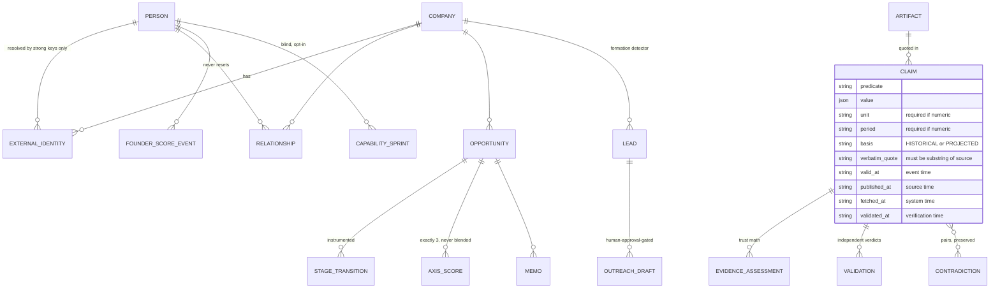

<div align="center">

# 🧠 VC Brain

### An evidence-first AI operating system for venture capital
**Sourcing → Screening → Diligence → Decision — a $100K check recommendation in under 24 hours, with every number traceable to a quoted source.**


*Built for Hack-Nation Global AI Hackathon · Challenge 02 — The VC Brain (Maschmeyer Group)*

</div>

---

**The one-sentence pitch:** capital flows through networks, not merit — VC Brain replaces "who do you know" with an append-only evidence graph where eight agents find founders before they fundraise, verify every claim independently, preserve every contradiction, and hand a human a decision they can defend.

**The one-sentence differentiator:** honesty here is *architecture*, not prompting — there is no schema field that could hold a blended company score, no code path by which an LLM can delete a contradiction, and no way for a claim to enter the graph without a verbatim quote from its source.

## Table of contents

- [How it works — 60-second tour](#how-it-works--60-second-tour)
- [Architecture](#architecture)
- [The evidence graph (data model)](#the-evidence-graph-data-model)
- [The formulations](#the-formulations)
- [The research behind the design](#the-research-behind-the-design)
- [Tech stack](#tech-stack)
- [Running locally](#running-locally)
- [Demo script (~5 minutes)](#demo-script-5-minutes)
- [Non-negotiables (and where they live)](#non-negotiables-and-where-they-live)

---

## How it works — 60-second tour

| Screen | What actually happens |
|---|---|
| 🏠 **Home** | Entry map + direct search of GitHub / arXiv / Hacker News for any idea |
| 📊 **Pipeline** | Kanban across the four stages, with **time-to-decision instrumentation** in the header (median first-signal→decision, deals decided within 24h, bottleneck stage) — all derived from logged stage transitions, never estimated |
| 📡 **Scout** | Live ingestion from GitHub/HN/arXiv feeds a **formation detector**: a lead fires only when 5 conditions all hold. Each card answers *"why did this surface now?"* and renders the actual link graph that produced it |
| 🔍 **Opportunity** | Three independent axis bars (never one number), preserved contradiction cards with both quotes side-by-side, per-claim trust math, 4 timestamps per claim, memo with evidence chips, dossier PDF, full agentic trace |
| 🎯 **Thesis & query** | Change the fund lens → Scout re-ranks live. One compound query ("technical founder, Berlin, AI infra, enterprise traction, no prior VC backing, top-tier accelerator") resolves in a single graph pass with per-clause evidence |
| 📥 **Apply** | Inbound minimum bar: company name + pasted deck. Deck → atomic claims → same funnel. A zero-footprint founder gets a **blind Capability Sprint** instead of a penalty |

## Architecture



### What one diligence run looks like



## The evidence graph (data model)

Append-only, event-sourced: **nothing is ever overwritten** — corrections append with `supersedes`, competing claims coexist, and the canonical view exposes its alternatives.



**Why four timestamps?** A 2023 commit *discovered today* is not fresh founder momentum. Recency scoring reads event time, never fetch time — the leading source of look-ahead bias in startup-prediction systems ([Żbikowski & Antosiuk 2021](https://www.sciencedirect.com/science/article/pii/S0306457321000595)).

## The formulations

Every score in the product reduces to arithmetic you can check by hand. All of it is versioned (`rule_version` on every output) and reproduced in the agentic trace.

### 1 · Per-claim Trust Score (`adjudicator.ts`)

$$Trust = \text{clamp}\big(30P + 25D + 20R + 15Rec + 10A - C,\ 0,\ 100\big)$$

| Component | Range | How it's set |
|---|---|---|
| **P** — provenance | 0–1 | Who authored the artifact: deck/transcript 0.40 · company site 0.55 · derived-with-shown-math 0.65 · HN 0.70 · GitHub 0.85 · arXiv 0.90 |
| **D** — directness | 0–1 | Verbatim quote present 1.0 · derived 0.8 · else 0.6 |
| **R** — source reliability | 0–1 | Same ladder as provenance, independently weighted |
| **Rec** — recency | 0–1 | **Cadence signals decay** `e^(−days/90)` (floor 0.1); **achievements never decay** (an exit, a paper, a shipped release = 1.0 forever) |
| **A** — agreement | 0–1 | Validator verdict: supported 1.0 · partly 0.65 · unchecked 0.5 · contradicted 0.1 |
| **C** — conflict penalty | 0–30 | Max over open contradictions touching this claim: hard 30 · material 20 · minor 10 |

**Bands:** 80–100 `Verified` · 60–79 `Corroborated` · 40–59 `Founder-stated` · <40 `Weak / disputed`.

### 2 · Deterministic contradiction rules (run *before* any LLM)

For two numeric claims $a, b$ on the same subject + predicate:

$$rel = \frac{|a-b|}{\max(\min(|a|,|b|),\ 1)} \qquad rel > 0.25 \Rightarrow \text{flag};\quad rel > 0.40 \Rightarrow \text{material};\quad rel > 0.75 \Rightarrow \text{hard}$$

Plus: unit mismatch, period mismatch (waived for derived annualizations), temporal ordering (a historical metric cannot precede the founding date), employment-nature conflicts (contractor vs employee), and **scope confusion** (ARR claimed while the company's own pricing page says pilots are free). An LLM may *annotate* why a flagged pair might reconcile — it has **no code path to remove a flag**.

### 3 · Persistent Founder Score (`founderScore.ts`)

Event-sourced per person; follows a stable identity (e.g. GitHub ID) across companies, **never resets**.

$$component_i = \text{clamp}\Big(50 + \sum \delta_{events}\Big) \qquad FounderScore = \frac{\sum_i w_i \cdot component_i}{\sum_i w_i}$$

| Component | Weight | | Component | Weight |
|---|---:|---|---|---:|
| Verified execution record | 22 | | Customer-learning quality | 12 |
| Problem/domain understanding | 15 | | Collaboration & complementarity | 10 |
| Technical/product craft | 13 | | Integrity & calibration | 8 |
| Learning & follow-through velocity | 13 | | Prior venture outcomes *(missing = neutral, never negative)* | 7 |

**Cold start:** every component starts at a neutral **50**. Coverage = evidenced components ÷ 8. The number is only *shown* when coverage ≥ 0.50 — below that the UI says **"not enough evidence"**. Uncertainty band:

$$band = score \pm \big(8 + 35\,(1 - coverage)\big)$$

🚫 **Banned as features under any name** (stripped from scorer input before any model sees them): school prestige, employer brand, follower counts, network size, location, age, gender, ethnicity, inferred personality.

### 4 · Blind Capability Sprint (the cold-start equalizer)

Opt-in for founders below 0.50 coverage; scored under a **random blind ID** with zero school/employer/network data visible.

| Rubric component | Max | Feeds Founder component |
|---|---:|---|
| Problem investigation packet (ICP, costly workflow, 3 testable assumptions, strongest *disconfirming* evidence) | 30 | domain |
| Work sample — founder picks technical / product / operator track | 35 | craft |
| Evidence calibration (label 10 mixed claims fact/inference/unknown) | 20 | integrity |
| Collaboration simulation (async handoff under an imposed constraint) | 15 | collaboration |

Each result becomes a dated artifact + claim, then Founder-Score events via $\delta = \text{round}\big((\frac{score}{max} - 0.5) \times 30\big)$ — the **same mechanism as public evidence**, so a sprint-evidenced founder is directly comparable with a GitHub-evidenced one.

### 5 · Three screening axes — never averaged

Each axis scored by an **independent** scorer that sees only trust-weighted claims (projected figures barred from traction inputs):

| Founder axis | w | Market axis | w | Idea-vs-Market axis | w |
|---|---:|---|---:|---|---:|
| Founder Score (injected) | 25% | Pain + willingness to pay | 25% | Problem-solution evidence | 25% |
| Capability for *this* problem | 20% | Bottom-up SAM + budget owner | 20% | Wedge / ICP specificity | 20% |
| Execution velocity | 20% | Structural timing trigger | 15% | Differentiation vs workaround | 15% |
| Collaboration | 15% | Competition / switching friction | 15% | GTM feasibility | 15% |
| Integrity | 10% | Growth economics | 15% | Unit economics | 15% |
| Commitment | 10% | Regulatory risk | 10% | Pivot surface area | 10% |

A subscore with **no evidence is `null` — excluded, never zero**. Axis score = weight-renormalized mean of non-null subscores; coverage = Σ weights of non-null; shown only when coverage ≥ 0.50; band = score ± (10 + 30·(1−coverage)). Market labels: **Bull ≥ 70 · Neutral 45–69 · Bear < 45**.

### 6 · Formation detector (Scout)

A `pre-raise lead` fires **only when all five conditions hold** in a rolling 30-day window:

> **(a)** ≥2 identity-linked builders · **(b)** ≥2 *independent* artifact types · **(c)** accelerating 14-day velocity (recent > prior window) · **(d)** active-thesis fit · **(e)** no confirmed institutional funding

$$LeadScore = \underbrace{Novelty}_{\le 25} + \underbrace{Corroboration}_{\min(25,\ 9 \times sources)} + \underbrace{Velocity}_{20 \text{ if accelerating}} + \underbrace{ThesisFit}_{\le 20} + \underbrace{EvidenceQuality}_{\le 10}$$

Every lead is labeled `REACH_OUT_CANDIDATE` — a literal type; nothing else is representable. **Never an auto-investment.**

### 7 · Decision matrix (routing — never a blend)

| Pattern | Route |
|---|---|
| **Any open HARD contradiction** (identity / revenue / material) | 🛑 **HOLD for human review — overrides every score** |
| Founder ≥ 70 AND Idea-vs-Market ≥ 65, no red flag | ✅ Advance — propose **$100K check** (clamped to thesis range), subject to human sign-off |
| Founder ≥ 70, Market Bull, Idea < 60 | 📞 Founder call + pivot conversation |
| Idea ≥ 70, Founder < 60 | 📋 Request evidence / team-completion plan |
| Anything else (incl. insufficient coverage) | 📋 Default to evidence request |

## The research behind the design

We verified every citation against its primary source (19 Jul 2026) — and, just as importantly, documented what the popular AI-VC playbooks recommend that we **refused to build**. Full detail with confidence labels: **[RESEARCH.md](RESEARCH.md)**.

| Verified finding | Source | What it changed in VC Brain |
|---|---|---|
| Prior successful founders outperform — but it's a population-level effect, structurally unavailable to first-timers | [Gompers, Kovner, Lerner & Scharfstein, JFE 2010](https://www.nber.org/papers/w12592) | `prior_outcomes` weighted only 7/100; **missing = neutral, never negative** |
| Look-ahead bias is the dominant failure of startup-success ML (213k-company study) | [Żbikowski & Antosiuk 2021](https://www.sciencedirect.com/science/article/pii/S0306457321000595) | Four timestamps per claim; trends only from dated comparable windows |
| Founder base rates ~1.9%; false positives cost more (F0.5); anonymization resists identity leakage | [VCBench, arXiv:2509.14448](https://arxiv.org/abs/2509.14448) | Precision-biased routing, HOLD overrides, blind sprint anonymization |
| Only ~0.78% of 67k Product Hunt launches reached Series A in 18 months | [PHBench, arXiv:2605.02974](https://arxiv.org/html/2605.02974v1) | Launch attention = corroboration only, never traction |
| Twitter "legitimacy" predicted survival — via *engagement content*, not follower counts | [Antretter et al., JBVI 2019](https://www.sciencedirect.com/science/article/pii/S2352673418301197) | Footprints are discovery cues + evidence carriers, never score features |
| Across 4,323 YC companies, visible credentials (FAANG, elite schools) explain **<4%** of funding variance; effects sign-flip in robustness checks | [Adl 2025, arXiv:2512.13755](https://arxiv.org/abs/2512.13755) | Empirical backing for banning school prestige & employer brand outright |

**What we rejected — on purpose:** network centrality / "talent gravity" weights, follower-growth "market resonance", education-prestige × relevance tiers, "prestige sacrifice" indexes, and any single blended invest-score. Each one is an access proxy that would quietly rebuild the network-gated system this challenge exists to replace. The rejection table with grounds is in [RESEARCH.md](RESEARCH.md).

## Tech stack

| Layer | Choice | Why |
|---|---|---|
| Frontend | **Next.js 15 · React 19 · TypeScript 5** on port 4028 | Pivoted from our own ResearchOS platform — same glass design system (Tailwind + CSS-variable tokens, framer-motion, lucide), new information architecture |
| Backend | **Next.js 15 API routes** on port 4029 | Typed end-to-end; frontend proxies `/api/*` via rewrite |
| Storage | **Append-only JSON event store** (one file per table, `supersedes` semantics, sha256-archived raw payloads) | Honesty guarantees are enforceable at the write layer; demo-scale by design |
| LLM | Any **OpenAI-compatible** endpoint — primary `gpt-4o-mini` (AIML API), fallback **Groq `llama-3.3-70b-versatile`** | Temperature 0, retry w/ backoff, 90s abort, single-pass JSON repair; **all trust/score arithmetic is deterministic code, LLMs only classify and draft** |
| Live data | GitHub REST · Hacker News Firebase · arXiv Atom (throttled 1 req/3s) | Free-tier, ToS-clean; LinkedIn never touched; funding history is a labeled local stub |
| Docs/PDF | `@react-pdf/renderer` | Memo (the argument) + Dossier (the complete evidence record) |
| Outreach | Resend | Send endpoint **refuses** any draft without explicit human approval |

## Running locally

```bash
# Terminal 1 — backend (port 4029)
cd backend && npm install && npm run dev

# Terminal 2 — frontend (port 4028)
cd frontend && npm install && npm run dev
```

Open **http://localhost:4028**. Backend `.env` (see `.env.example`): `LLM_BASE_URL` / `LLM_API_KEY` / `LLM_MODEL` (required); optional `LLM_FALLBACK_*` (e.g. Groq), `LLM_MODEL_HEAVY`, `GITHUB_TOKEN` (raises live-Scout rate limits), `RESEND_API_KEY` + `RESEND_FROM_ADDRESS` (human-approved sends).

> ⚠️ During development use `npm run dev` only — running `next build` into the default `.next` while the dev server is up corrupts its cache (fix: `rm -rf .next` and restart).

## Demo script (~5 minutes)

1. **Pipeline** (`/pipeline`) — header instrumentation: median first-signal→decision, decided-within-24h, bottleneck stage — all from logged transitions. Click **Seed synthetic deal**.
2. **Run diligence** on Driftlock AI (labeled SYNTHETIC). The deck contains three planted lies; watch all three get caught:
   - **$400k ARR** claimed while its own cohort table implies **$180k** — the Validator's shown calculation (`$15,000 MRR × 12`) becomes a derived claim → HARD revenue contradiction;
   - **$50B TAM** claimed where bottom-up accounts × ACV lands near **$750M** → HARD market contradiction;
   - **"ex-Google engineer"** claimed while the company site says **contractor via staffing agency** → identity contradiction;
   - bonus: ARR claimed while the pricing page says pilots are free → scope confusion.
3. **Opportunity view** — three separate axis bars with coverage + uncertainty bands (below 0.50 coverage the UI honestly reads "not enough evidence"), preserved contradiction cards with both quotes side by side, per-claim trust math, four timestamps per claim, the HOLD banner, the memo with expandable evidence chips, hypotheses **with falsifiers**, "not disclosed" flags, and the full agentic trace. Two PDFs: **memo** (the argument) and **dossier** (the complete evidence record).
4. **Scout** (`/leads`) — **Seed synthetic Scout demo** (labeled) or **Run bounded live scan** (real GitHub/HN/arXiv). Every lead answers "why did this surface now?", shows all five formation conditions with evidence references, renders its **link graph**, and is labeled REACH-OUT CANDIDATE. Note the same founder appears in both demo leads with one persistent Founder-memory score.
5. **Activator** — draft outreach on a lead: it cites the exact artifacts that surfaced the lead. The send button only exists after explicit human approval; the API refuses anything else.
6. **Thesis** (`/thesis`) — switch to *industrial software / London / seed* and save: Scout re-ranks live with matched/unmatched criteria per lead. Evidence is never rewritten — only the lens changes.
7. **Compound query** (same page) — run the brief's exact query: one graph pass resolves all six clauses, each match citing the exact claim + source artifact; near-misses list what's missing.
8. **Promote a lead** — one click into the same pipeline as inbound: one funnel, two entry points.
9. **Apply** (`/apply`) — company name + pasted deck → real extracted claims → same funnel.
10. **Blind Capability Sprint** — on the cold-start founder's card (coverage 0, "not enough evidence"), run the sprint: scored under a random blind ID, four components gain evidence, and the Founder Score moves to a number with an honestly wide band.

## Non-negotiables (and where they live)

| Constraint | Enforced in |
|---|---|
| Three axes never averaged; **no schema field could hold a blend** | `backend/lib/vc/agents/screener.ts` |
| Every number traces to a source or a shown calculation; else "not disclosed" | `memoWriter.ts` · `validator.ts` |
| Missing evidence is neutral (`null`), never zero | `screener.ts` · `founderScore.ts` |
| No access-proxy features in any score (input-level strip) | `founderScore.ts` → `BANNED_PREDICATES` |
| Per-claim trust; contradictions preserved forever — LLM may explain, never delete | `adjudicator.ts` |
| Outreach drafts only; send path refuses non-human-approved drafts | `activator.ts` |
| Human decides; hard contradictions force HOLD over every score | `screener.ts` → `routeDecision` |
| LinkedIn never touched; funding history a labeled stub; synthetic data labeled in UI | `scout.ts` · seed modules |

## Repository layout

```
backend/lib/vc/            schema · append-only store · cartographer · trace
backend/lib/vc/agents/     extractor · validator · adjudicator · screener · founderScore
                           capabilitySprint · memoWriter · activator
backend/lib/vc/scout.ts    live + demo ingestion · formation detector · link graph
backend/lib/vc/thesis.ts   configurable thesis (append-only config history)
backend/lib/vc/query.ts    compound multi-attribute graph query
backend/lib/vc/report/     memo PDF · dossier PDF
backend/app/api/vc/        REST routes: seed · apply · diligence · opportunity · pipeline
                           scout · leads · thesis · query · outreach · sprint · trace · pdf
frontend/src/app/          home · pipeline · opportunity/[id] · leads · thesis · apply
RESEARCH.md                verified evidence base + the features we deliberately rejected
```

## Deploying

Deploy `frontend/` and `backend/` as two services (e.g. two Vercel projects). Set `BACKEND_URL` on the frontend and `FRONTEND_URL` on the backend (CORS). The JSON-file store assumes a persistent disk — for serverless, mount a volume at `backend/data/`.

---

<div align="center">

**The system recommends and shows its work. A human makes the call.**

*Team HN-9101 · Hack-Nation 6th Global AI Hackathon · July 2026*

</div>
