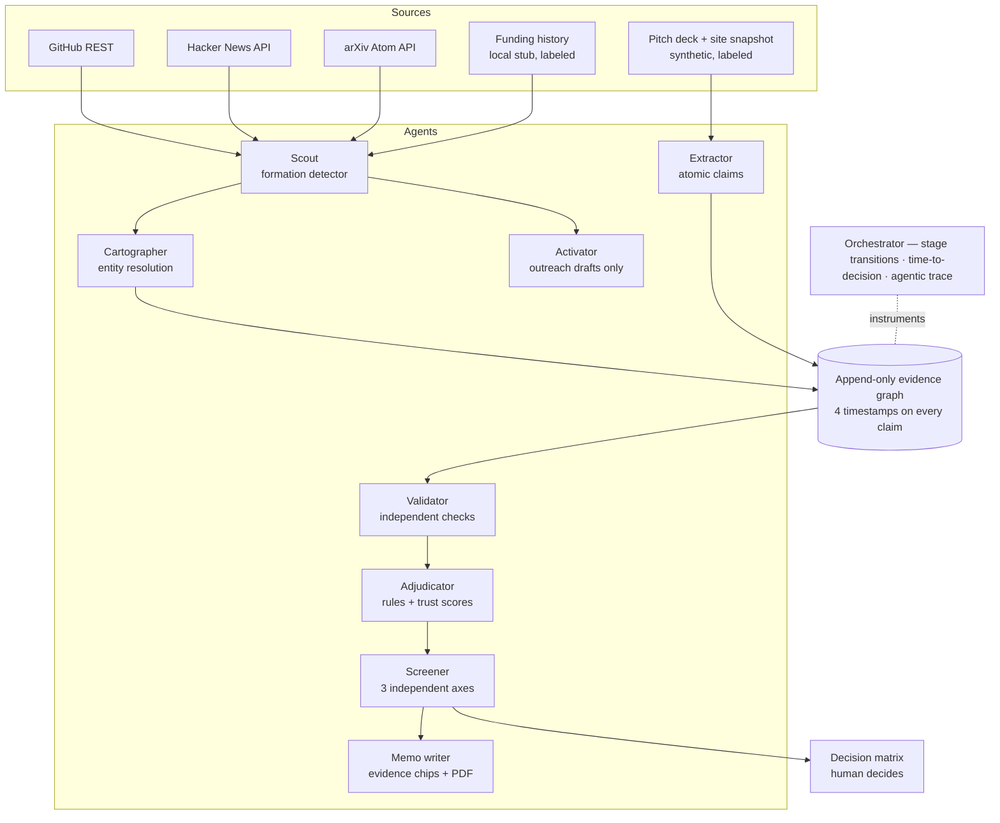

# VC Brain

An AI operating system for venture capital covering exactly four stages — **Sourcing → Screening → Diligence → Decision** — built on one append-only evidence graph. Eight agents source pre-raise signals, extract atomic claims, verify them independently, preserve every contradiction, score three independent screening axes, and write evidence-chipped memos. The system recommends and shows its work; a human makes every decision and approves every outgoing email.

Pivoted from the ResearchOS multi-agent platform: same visual language, same orchestration backbone, new information architecture.

## Architecture



**Cartographer** (the data core): every fact is a `Claim` with a verbatim quote, a locator (slide/page), and four distinct timestamps — event time, published time, fetched time, validated time — so a 2023 commit discovered today can never masquerade as fresh momentum. Records are never overwritten; corrections append with `supersedes`. Competing claims coexist and the canonical view exposes its alternatives.

**Trust** is per-claim, never per-company: `30·provenance + 25·directness + 20·reliability + 15·recency + 10·agreement − conflict penalty`, banded Verified / Corroborated / Founder-stated / Weak-or-disputed. Deterministic contradiction rules (value tolerance, unit/period mismatch, temporal order, role nature, scope confusion) run **before** any LLM; an LLM may annotate why a flagged pair might reconcile, but can never remove a flag.

**Screening** produces three independent axes (Founder / Market / Idea-vs-Market), each with coverage, an uncertainty band, and a trend — never averaged, never blended, no aggregate number anywhere. Below 0.50 coverage the UI says "not enough evidence" instead of showing a number. A hard contradiction on a material claim routes to **HOLD for human review** regardless of every score.

**Founder Score** is persistent and person-scoped (stable external identities, e.g. a GitHub ID, followed across companies — the demo shows the same founder surfacing in two leads with one shared score). Cold start = neutral prior 50 with low coverage; missing public data is missing, never adverse. Banned as features under any name: school prestige, employer brand, follower counts, network size, location, age, gender, ethnicity, inferred personality — stripped before any scorer sees the input.

**Cold start is a headline feature, not an afterthought**: a founder below 0.50 evidence coverage can opt into a **blind Capability Sprint** — scored under a random ID with no school/employer/network data visible to the evaluator (problem investigation 30 · work sample 35 · evidence calibration 20 · collaboration 15). Results enter the evidence graph through the same event mechanism as public artifacts, so sprint-evidenced and GitHub-evidenced founders are directly comparable. Design decisions and every citation behind them are documented and independently verified in [RESEARCH.md](RESEARCH.md).

## Running locally

Backend (port 4029):

```bash
cd backend && npm install && npm run dev
```

Frontend (port 4028):

```bash
cd frontend && npm install && npm run dev
```

The frontend proxies `/api/*` to the backend (`BACKEND_URL`, default `http://localhost:4029`).

Backend `.env` (see `.env.example`): `LLM_BASE_URL` / `LLM_API_KEY` / `LLM_MODEL` (any OpenAI-compatible endpoint; calls run at temperature 0 with retry/backoff), optional `LLM_MODEL_HEAVY`, optional `GITHUB_TOKEN` (raises the live Scout rate limit), `RESEND_API_KEY` + `RESEND_FROM_ADDRESS` for human-approved outreach sends.

## Demo script (~5 minutes)

1. **Pipeline** (`/pipeline`) — note the header instrumentation: median first-signal→decision, deals decided within 24h, bottleneck stage — all derived from logged stage transitions. Click **Seed synthetic deal**.
2. **Run diligence** on Driftlock AI (clearly labeled SYNTHETIC). The deck has three planted lies; watch all three get caught:
   - claims **$400k ARR** while its own cohort table implies **$180k** — the Validator's shown calculation (`$15,000 MRR × 12`) becomes a derived claim and a HARD revenue contradiction;
   - claims a **$50B TAM** where bottom-up accounts × ACV lands near **$750M** — HARD market contradiction;
   - claims an **"ex-Google engineer"** while the company site says **contractor via staffing agency** — identity contradiction;
   - bonus: ARR claimed while the pricing page says pilots are free — scope confusion.
3. **Opportunity view** — three separate axis bars with coverage + uncertainty bands (an axis under 0.50 coverage honestly reads "not enough evidence"), the preserved contradiction cards with both quotes side by side, per-claim trust math, four timestamps on every claim, the HOLD banner, the memo with expandable evidence chips, hypotheses with falsifiers, "not disclosed" flags, PDF export, and the full agentic trace.
4. **Scout** (`/leads`) — **Seed synthetic Scout demo** (labeled) or **Run bounded live scan** (real GitHub/HN/arXiv). Each lead card answers "why did this surface now?" in one sentence, shows all five formation conditions with evidence references, and is labeled REACH-OUT CANDIDATE — never an auto-investment. Note the same founder appears in both demo leads with one persistent Founder-memory score.
5. **Activator** — on a lead card, draft outreach: it cites the specific artifacts that surfaced the lead (the Show HN, the release cadence, the paper). It is a **draft**; the send button only exists after an explicit human approval, and the API refuses anything else.
6. **Thesis** (`/thesis`) — change the thesis to *industrial software / London / seed* and save: the Scout ranking flips live, with matched/unmatched criteria shown per lead. Evidence is never rewritten — only the lens changes.
7. **Compound query** (same page) — run `technical founder, Berlin, AI infra, enterprise traction, no prior VC backing, top-tier accelerator`: one pass over the graph resolves all six clauses, each match citing the exact claim and source artifact; near-misses list which clauses are missing.
8. **Promote a lead** — one click moves it into the same pipeline as the inbound deal: one funnel, two entry points.
9. **Apply** (`/apply`) — the inbound minimum bar from the brief: company name + pasted deck. The deck becomes real extracted claims and enters the same funnel. Submit a first-time founder with no footprint to see the cold-start path.
10. **Blind Capability Sprint** — on the applicant's founder card ("not enough evidence", coverage 0), run the sprint: score appears under a random blind ID, four components gain evidence, coverage reaches 0.50, and the Founder Score moves from "not enough evidence" to a number with an honest wide band.

## Non-negotiables (and where they live)

- Three axes are never averaged; no aggregate score exists in the schema — `backend/lib/vc/agents/screener.ts`
- Every number traces to a source or a shown calculation; unavailable data renders "not disclosed" — `memoWriter.ts`, `validator.ts`
- Missing evidence is neutral (null), never zero — `screener.ts`, `founderScore.ts`
- No access-proxy features in any score (input-level strip) — `founderScore.ts` `BANNED_PREDICATES`
- Per-claim trust; contradictions preserved forever, LLM may explain but never delete — `adjudicator.ts`
- Outreach drafts only; the send path refuses non-human-approved drafts — `activator.ts`
- Human decides: routing is a recommendation; hard contradictions force HOLD — `screener.ts` `routeDecision`
- LinkedIn is never touched; funding history is a labeled local stub; all synthetic data is labeled in the UI

## Layout

```
backend/lib/vc/           evidence graph: schema, append-only store, cartographer, trace
backend/lib/vc/agents/    extractor · validator · adjudicator · screener · founderScore · memoWriter · activator
backend/lib/vc/scout.ts   live + demo ingestion, formation detector, link graph
backend/lib/vc/thesis.ts  configurable thesis, append-only config history
backend/lib/vc/query.ts   compound multi-attribute graph query
backend/app/api/vc/       REST routes (seed, diligence, opportunity, pipeline, scout, leads, thesis, query, outreach, trace, memo/pdf)
frontend/src/app/         pipeline · opportunity/[id] · leads · thesis (ResearchOS shell + tokens)
```

Research-era screens remain in the repo as pivot foundation; active navigation exposes only the VC Brain workflow.

## Deploying

Deploy `frontend/` and `backend/` as two services (e.g. two Vercel projects). Set `BACKEND_URL` on the frontend to the backend URL, and `FRONTEND_URL` on the backend for CORS. Note the JSON-file store assumes a persistent disk — for serverless, point `data/` at a mounted volume.
